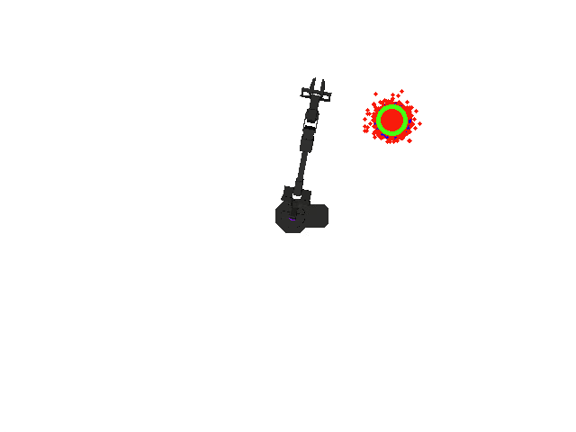
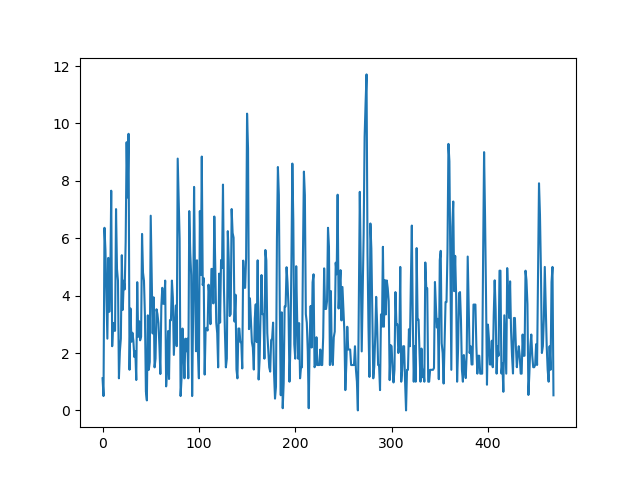
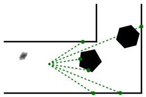
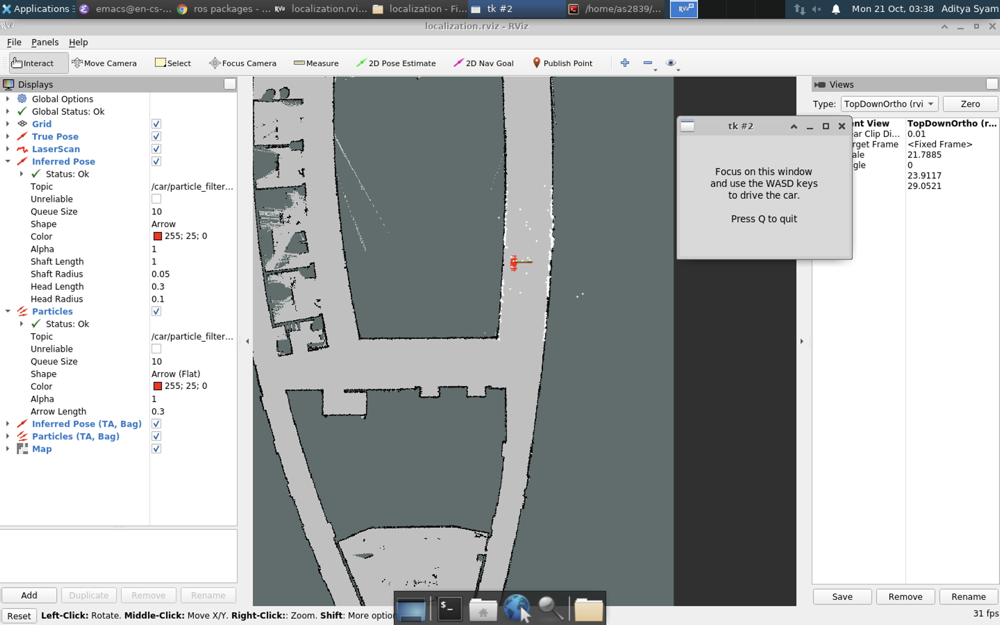

# Homework 3: State Estimation

## Overview 
In this project, you will implement the particle filter algorithm for MuSHR car and Widowx250 arm robot.

## Setup
Download skeleton code at https://github.coecis.cornell.edu/as2839/hw3_state_estimation
```
# Open a terminal
$ cd ~/Downloads
$ unzip hw3_state_estimation-main.zip
mv ~/Downloads/hw3_state_estimation-main ~/homework_ws/src
$ mv ~/homework_ws/src/hw3_state_estimation-main ~/homework_ws/src/hw3_state_estimation
$ cd ~/homework_ws
$ catkin clean
$ catkin build
$ source ~/homework_ws/devel/setup.bash
$ roscd arm_particle_filter/
```

## Section 1: Object tracking for Widowx 250 Arm (85 points)
Object tracking refers to locating moving objects over time upon initial detection of the object. One of the main advantages of using tracking algorithms is robustness to noise and occlusions during object detection. For a variety of tasks involving robot arms, like visual servoing and in-hand manipulation, it is crucial to accurately detect and track the target object. Visual servoing involves controlling a robot arm using feedback from vision-based sensors. We have designed a toy visual servoing experiment with the arm end-effector following a cylinder moving around it. In the experiment setup, we use RGB image obtained from a camera placed above the robot arm capturing the top down view. In this section, you will track the moving cylinder by implementing the particle filter algorithm.

### \# Code Review
Your particle filter keeps track of the possible states i.e. positions of the cylinder using particles and weights, which are NumPy arrays of shape (M, 2) and (M,) respectively. Each particle is a candidate state, and the weight represents its probability.

We have provided a `ParticleFilter` class in `src/arm_particle_filter/particle_filter.py`. In addition, we also provide the code to initialize the robot arm in `src/arm_particle_filter/init_env.py`. The initial position of the cylinder depends on the initial pose estimate from the particle filter, which in turn depends on the `initial_mean` parameter in `src/arm_particle_filter/tracker.py`.

The `CylinderTracker.get_detection` method in `src/arm_particle_filter/tracker.py` detects the position of the cylinder, where the cylinder moves based on the *estimated* position from the particle filter at the previous timestep, and the `ParticleFilter` keeps track of the detected cylinder based on a simulated noisy measurement of the position. Note that the cylinder dynamics are driven by the noise inherent in the particle filter (that is, the cylinder does not move independently of the particle filter!). The tracked position of the cylinder is used to command the end-effector of the WidowX 250 arm.  You will also implement the `LowVarianceSampler` class for particle resampling in `src/arm_particle_filter/resampler.py`.

Implement the three main steps i.e *predict*, *update* and *resample* for the `ParticleFilter`. Your implementations must modify the entries of the particles and weights NumPy arrays in-place<sup>[1](#1)</sup>.

**Q1.1** Begin by implementing the `ParticleFilter.predict` method. For a cylinder, we can simply apply a noisy constant velocity model to the particles. First add u * dt and then add noise with zero mean and standard deviation of u. In the predict step, try to modify self.particles in place and more information on how to do that can be found below. 

**Q1.2** Next, implement the `ParticleFilter.update` to update the particle weights by obtaining the observation from the detector. To calculate the likelihood for each particle, use the distance of the particle farthest away from the observation subtracted by the distance of the considered particle from observation which can be denoted by `max(distance) - distance`. In the update step, try to modify self.weights in place. 

After implementing these two methods, run the following commands (assuming you are in the arm_state_estimation directory):
```
chmod +x test/particle_filter.py
rostest arm_particle_filter particle_filter.test
```
You should expect to pass all the tests.

Note: vectorizing matrix operations is necessary for passing the test cases so try to avoid using for loops. 

**Q1.3** Finally, you need to implement the `LowVarianceSampler.resample` method to replace particles with low or negligible weights with particles with high proximity to particles with higher weights. Make sure to reset all the weights so that each particle has an equal likelihood of being the ground truth. After completing this, you should expect to pass all the tests in:
```
python3 test/resample.py
```

Run the following command to start the visual servoing demo.
```
roslaunch arm_particle_filter tracking.launch
```
You should be able to see the red particles attempting to tracking the moving cylinder.

Troubleshooting common errors: In case you get an error similar to "interbotix_xsarm_control" does not exist, catkin clean and build your interbotix_ws.
If you get an error saying tracking launch is not a launch file or something similar, trying catkin clean and build for the homework_ws.
Rebuilding both the interbotix_ws and homework_ws should almost certainly solve any errors in running the test.


<figure>
  
  <figcaption> Example particle Filter with untuned parameters. The red points are particles. the blue circle is the observation obtained from detector. the green circle is the estimated position from particle filter, and the black object is the robot arm.</figcaption>
</figure> 

Now that you have a working object tracker. Then next step is to tune the parameters of your implementation of particle filter to improve the tracking performance and chase down the cylinder more closely.

**Q1.4** Head over to `arm_particle_filter/tracker.py`. You will find the following parameters that need to be tuned to improve the overall tracking performance.

```
# Number of particles to be initialized for the particle filter
num_particles = 1000

# Constant velocity to be supplied to ParticleFilter.predict
self.constant_vel = np.array([0, 0])

# Sample motion model noise with this std=std_constant_vel
std_constant_vel = 100

# Initial mean and covariance of the sampled particles
initial_mean = np.array([320, 320]).reshape((-1, 1))
initial_cov = np.diag([10e7, 10e7])

```
We will evaluate your performance using the mean position error. You are also expected to describe your tuning approach and elaborate on your observations in a qualitative answer. Once you are satisfied with your tuning and are passing the test below, describe how you approached the tuning process - explain your rationale and any observations you noticed while tuning the parameters. Be as detailed as possible and include your answer in the README file in the hw3_state_estimation/writeup.
Upon tuning, run the following commands.
```
chmod +x test/tracking.py
rostest arm_particle_filter tracking.test
```
After successfully tuning the parameters, you should be able to pass the above test. 
**Warning**: There is a maximum time constraint on the tracking test. 
If you wait for the test to close the window by itself, it will not pass. 
You should manually closed the test after getting the plot, at which point you should see the test pass.

<figure>
  
  <figcaption> Example particle Filter with tuned parameters.</figcaption>
</figure> 

You should also find a new plot tracking the position error across time at `~/.ros/position_error.png`. It will look like the following:
<figure>
  
  <figcaption> Example Position error across time plot</figcaption>
</figure> 

**Note**: Your generated figure will also contain a red line in addition to the plot shown below, which is expected to indicate the running mean position error.

**Please include this figure in your submission**. Place this figure in a new folder named `figures` in your submission so that its relative path inside the submission is: `/hw3_state_estimation/figures/position_error.png`

<details>
<summary>Rubric</summary>

+ particle filter, 4 tests (30 points total)
+ resample, 4 tests (total 35 points)
+ tuning test (10 points)
+ position_error.png (5 points)
+ description of tuning approach (5 points)
</details>

## Section 2: Localization for MuSHR car (35 points)

<figure>
  
</figure> 

Besides object tracking, particle filters are also popularly used for localization. The particle filter for the MuSHR car localization depends on the motion model of the car, the sensor model i.e. the observation model using Laser sensor readings. You already implemented the motion model for the MuSHR car as part of the Kinematics homework. For now, we provide a ROS wrapper class `KinematicCarMotionModelROS` in `src/localization/motion_model.py` for accessing the same set of methods that you already implemented earlier. In addition, we also provide you with a pre-implemented sensor model for the MuSHR car. Make sure you have already implemented the `LowVarianceSampler` in the previous section as we would be reusing it.

You are tasked with the responsibility of appropriately initializing the particle and corresponding weights i.e. implement the initialization step for the particle filter in `src/localization/particle_filter.py`.

We use a raycasting library called rangelibc (implemented in C++/CUDA), which casts rays into the map from the robot’s state and measures the distance to any obstacle/wall the ray encounters. This is similar to how the physical LIDAR unit measures distances.

If you see a range_libc folder in your home directory, start with the second command. Otherwise, download the zip file from https://github.com/empriselab/range_libc.git.

```
# Open a terminal
$ cd ~/Downloads
$ unzip range_libc-main.zip
$ mv ~/Downloads/range_libc-main ~/
$ cd ~/
$ cd range_libc-main
$ cd pywrapper 
$ python3 setup.py install --user
```

**Q2.1**: Implement the method `ParticleInitializer.reset_click_pose`, which initializes the belief of the robot `src/localization/particle_filter.py`. Given a [geometry_msgs/Pose](http://docs.ros.org/en/noetic/api/geometry_msgs/html/msg/Pose.html) message describing the robot’s initial state, your code should initialize the particles by sampling from this Gaussian distribution.

After completing **Q2.1**, expect your code to pass all the test cases when running 
```
roscd localization
python3 test/particle_initializer.py

```

**Q2.2**: Implement the publishers in `src/localization/particle_filter.py`. We want you to define the publishers to the topics whose names are stored in "~inferred_pose", "~particles", and "~odom" respectively. Ensure that the publishers are assigned the appropriate names. We also want to ensure that the correct types of messages are published. 

In this case, there are no launch files to refer to for publisher names. Refer to the file `src/localization/particle_filter.py` itself for hints - look at the imports at the top and the other functions within the ParticleFilter class. You can assume the queue size is 1 for all the topics.

There are no tests for the publishers - the easiest way to check them is by checking if the visualization in RViz below is working. If any of the publishers is not correct, you will not see a visualization similar to the one shown below. We will also be checking the publishers manually.

You can test your particle filter in simulation with:
```
$ roslaunch localization particle_filter_teleop_sim.launch map:='$(find cs4750)/maps/cse2_2.yaml'

```

By default, this will initialize a simulation with the robot at the origin and open a tailored RViz view of the world. You should see the robot (a green shaft) along with the inferred pose (in red) and particles (in white) within the RViz window. 

Troubleshooting common errors: If you only see a green shaft surrounding by white particles, your publishers have not been defined correctly. Revisit your particle_filter.py to ensure your publishers are defined with the correct names and message types.

To reposition the robot in simulation, you could minimize the tool key window and use the WASD keys as per the instructions.  

Alternatively, you could use the “Publish Point” tool in the RViz toolbar: select the tool then click where on the map you want the robot to be. You’ll see the green pose arrow move to that position in a default orientation. After moving the robot with “Publish Point”, you should reinitialize it by using the “2D Pose Estimate Tool”. Select the tool, then click on the position you want to specify and drag in the desired direction.

As you drive the vehicle around, you should see your particle filter approximately correspond to the true pose of the robot. 

Once your vehicle is moved from the default initial point **(ensure that your screenshot does not show the default position that we have provided)**, take a screenshot of your RViz window and include this with your submission.

It will look something like the following (depending on where you move your vehicle); ensure the inferred pose and particles information is expanded on the left panel - we want to make sure RViz is receiving the messages as expected:

<figure>
  
</figure> 

**Please include this figure in your submission**. Place this figure in the same folder named `figures` in your submission so that its relative path inside the submission is: `/hw3_state_estimation/figures/rviz_tracking.png`


<details>
<summary>Rubric</summary>

+ 2 tests, total 15 points
+ 3 publishers, 5 points each
+ rviz_tracking.png, 5 points
</details>

## Submission
Zip your homework code and submit to Gradescope. Due date: Nov. 6th. 

```
$ cd ~/homework_ws/src
$ zip -r hw3_state_estimation.zip hw3_state_estimation
```
---
<a name="1">1</a> Read more about in-place updates in python [here](https://www.interviewcake.com/concept/python/in-place).
